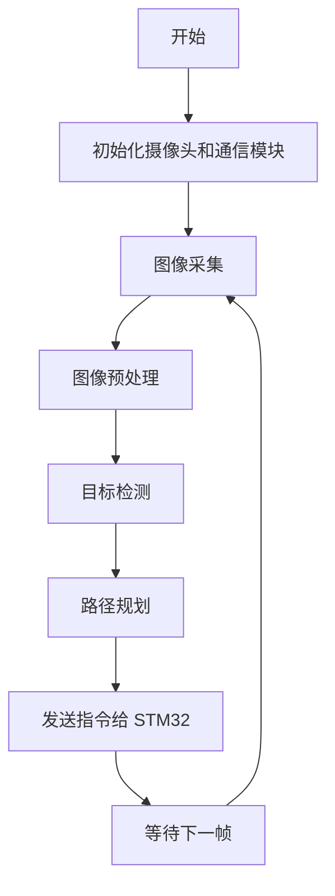
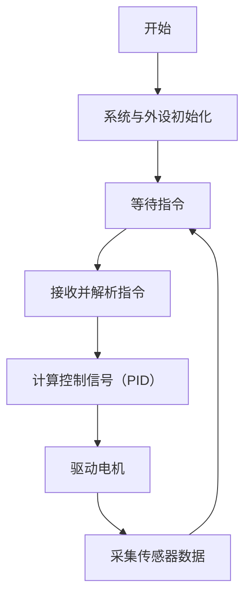

针对您的开发环境——Raspberry Pi 使用 Python 作为高层决策和图像处理平台，而 STM32 使用 C++ 进行实时控制，下面给出一种推荐的文件组织结构和相应的伪代码示例，方便您在分文件编写时合理划分各个功能模块。

---

## 1. 系统架构分模块

### 高层模块（运行在 Raspberry Pi 上，使用 Python）
- **摄像头驱动模块**：初始化摄像头、图像采集等（如 camera_driver.py）。
- **图像预处理模块**：图像去噪、格式转换等（如 image_preprocessing.py）。
- **目标检测/视觉识别模块**：调用深度学习或传统算法对图像进行目标识别（如 vision_detection.py）。
- **路径规划模块**：根据检测结果进行路径规划（如 path_planning.py）。
- **通信模块**：将高层决策（例如路径规划结果）通过串口或网络接口传递给 STM32（如 communication.py）。
- **主控制模块**：整合以上各模块，调度整体逻辑（如 main.py）。

### 低层模块（运行在 STM32 上，使用 C++）
- **主控制模块**：系统入口与全局任务调度（main.cpp）。
- **驱动与外设控制模块**：电机、舵机、传感器的初始化与控制（motor_control.cpp/.h）。
- **实时控制算法模块**：如 PID 控制算法（集成在 motor_control 或单独文件中）。
- **通信模块**：接收 Raspberry Pi 发来的命令，并反馈状态信息（communication.cpp/.h）。
- **传感器融合模块**：整合多个传感器数据，提供运动状态反馈（sensor_fusion.cpp/.h）。

---

## 2. 文件及目录组织示例

### Raspberry Pi 端（Python 项目）
```
RaspberryPi/
├── main.py                 # 主入口，整合各模块逻辑
├── camera_driver.py        # 摄像头初始化和图像采集
├── image_preprocessing.py  # 图像预处理功能
├── vision_detection.py     # 目标检测/视觉识别算法
├── path_planning.py        # 路径规划算法（例如 A* 算法）
├── communication.py        # 与 STM32 通信的接口
└── utils.py                # 工具函数
```

### STM32 端（C++ 项目）
```
STM32/
├── main.cpp                # 系统入口，负责主循环与任务调度
├── motor_control.cpp       # 电机控制及 PID 算法实现
├── motor_control.h         # 电机控制接口定义
├── sensor_fusion.cpp       # 传感器数据融合处理
├── sensor_fusion.h         # 传感器融合接口定义
├── communication.cpp       # 与 Raspberry Pi 通信接口实现
├── communication.h         # 通信接口定义
└── peripherals.cpp         # 其他外设（如LED、按键）驱动
```

---

## 3. 伪代码示例

### Raspberry Pi 主控流程（Python 伪代码）
```python
# main.py
from camera_driver import initialize_camera, capture_image
from image_preprocessing import preprocess
from vision_detection import detect_target
from path_planning import plan_path
from communication import init_communication, send_command
import time

def main():
    # 初始化各模块
    initialize_camera()
    init_communication()
    
    while True:
        # 图像采集与预处理
        image = capture_image()
        processed_image = preprocess(image)
        
        # 目标检测与路径规划
        target_info = detect_target(processed_image)
        path = plan_path(target_info)
        
        # 将规划结果发送至 STM32
        send_command(path)
        
        # 更新系统状态并等待下一次采集
        time.sleep(0.1)

if __name__ == '__main__':
    main()
```

### STM32 主控流程（C++ 伪代码）
```cpp
// main.cpp
#include "communication.h"
#include "motor_control.h"
#include "sensor_fusion.h"
#include <chrono>
#include <thread>

int main() {
    // 系统及外设初始化
    systemInit();          // 包括时钟、电机、传感器初始化
    initCommunication();   // 初始化与 Raspberry Pi 的通信接口
    
    while (true) {
        // 检查是否有新的指令到来
        if (newCommandReceived()) {
            Command cmd = readCommand(); // 从通信接口读取指令
            // 根据指令计算控制信号（例如采用 PID 算法）
            float controlSignal = computePID(cmd, getCurrentState());
            // 驱动电机执行控制
            setMotor(controlSignal);
        }
        // 更新传感器数据，进行状态反馈
        updateSensorData();
        
        // 简单延时，确保循环实时性
        std::this_thread::sleep_for(std::chrono::milliseconds(10));
    }
    
    return 0;
}
```

---

## 4. 流程图说明

### Raspberry Pi 端流程图


### STM32 端流程图


---

## 5. 总结

- **高层（Python）**：模块化编写，分别处理图像采集、预处理、目标检测、路径规划及通信。主程序（main.py）负责调用各模块，并以轮询方式处理实时图像和决策。
- **低层（C++）**：基于 STM32 实现实时控制。通过通信模块接收上位机指令，再利用 PID 控制算法计算控制信号，驱动电机执行动作，并不断采集传感器数据进行反馈。
- **分文件设计**：有助于代码维护和扩展，确保各模块之间接口清晰，降低耦合度。

如果您需要更详细的代码实现或者遇到具体问题，欢迎继续交流。